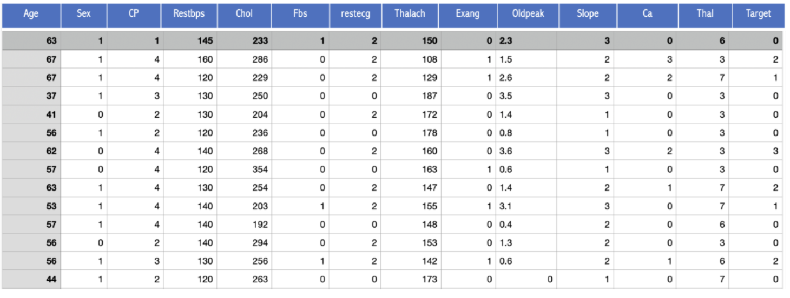
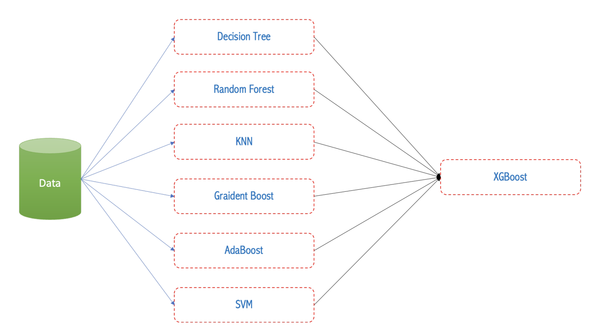
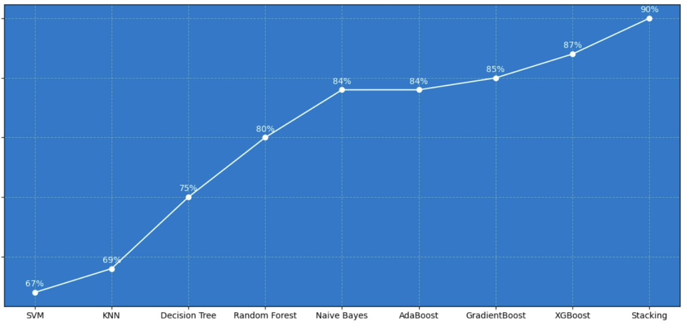

# Heart_Disease_Prediction
Project dự đoán khả năng bị bệnh tim của bệnh nhân

Ngày nay, số lượng các bệnh lý liên quan đến tim (heart disease) ngày càng gia tăng không phân biệt về giới tính hay lứa tuổi. Theo số liệu của WHO, bệnh tim là nguyên nhân gây tử vong lớn nhất thế giới. Trong đó, bệnh tim thiếu máu cục bộ chiếm 16% và đột quỵ chiếm 11% số ca tử vong trên toàn cầu. Kể từ năm 2000, số ca tử vong do căn bệnh này gia tăng nhiều nhất, tăng hơn 2 triệu đến 8,9 triệu ca tử vong vào năm 2019. Các bệnh lý tim thường gặp bào gồm các bệnh liên quan mạch máu (blood vessel diseases) như là bênh động mạch vành (coronary artery disease), các vấn đề loạn nhịp tim (arrhythmias) và dị tật tim bẩm sinh (ongenital heart defects), cùng nhiều bệnh lý khác.

Vì vậy việc dự đoán sớm bệnh tim mạch được coi là một trong những vấn đề quan trọng trong phân tích dữ liệu lâm sàn (clinical data analysis). Nhưng rất khó để xác định chính xác cũng như dự đoán sớm triệu chứng của bệnh tim vì có nhiều yếu tố nhứ tiểu đường, huyết áp cao, cholesterol cao, nhịp tim bất thường và nhiều yếu tố khác. Ngày nay, số lượng dữ liệu trong ngành chăm sóc sức khỏe là rất lớn (big data). Do đó, việc khai thác dữ liệu (data mining) và trích xuất thông tin từ bộ dữ liệu lớn này là cần thiết để hỗ trợ giúp chẩn đoán và phòng ngừa sớm các biến chứng liên quan tim mạch có thể xảy ra. Vì vậy, các nhà khoa học bắt đầu nghiên cứu các phương pháp hiện đại như Khai thác dữ liệu (data mining) và Học máy (machine learing) để dự đoán sớm khả năng bị bệnh tim dựa vào tiền sử sức khoẻ của bệnh nhân.

Trong project này, chúng ta sẽ áp dụng các phương pháp máy học cơ bản để dự đoán xem một người có khả năng mắc bệnh tim hay không dựa trên tập dữ liệu về Bệnh tim Cleveland dataset từ UCI Machine Learning Repository. Tập dữ liệu Cleveland bao gồm 14 thông tin như sau: tuổi (Age), giới tính (sex), trạng thái đau ngực (Chest-pain type), huyết áp khi nghỉ ngơi (Resting Blood Pressure), nồng độ cholesterol trong huyết thanh (Serum Cholestrol), chỉ số đường nhanh trong máu (Fasting Blood Sugar), kết quả điện tâm đồ khi nghỉ ngơi (Resting ECG ), nhịp tim tối đa (Max heart rate achieved), có bị đau thắt ngực khi tập thể dụng hay không (Exercise induced angina), chỉ số ST lúc tập thể thao so với lúc thư giãn (ST depression induced by exercise relative to res), chỉ số ST trong lúc hoạt động gắng sức (Peak exercise ST segment), Số lượng mạch chính (gồm động mạch, mao mạch và tĩnh mạch) được phát sáng thông qua nội soi huỳnh quang (Number of major vessels (0–3) colored by flourosopy ), thiếu máu tán huyết bẩm sinh (displays the thalassemia), và thông tin có bị biên tim hay không (Diagnosis of heart disease, 0 đại điện cho bệnh nhân không có bệnh, và 1,2,3,4 đại diện cho bệnh nhân có bệnh). Tập dữ liệu Cleveland bao gồm 303 mẫu với 14 thông tin trên được thể hiện thông qua :

Trong project này chúng ta sẽ sử dụng các giải thuật máy học khác nhau để dự đoán xem bệnh nhân có khả năng bị bệnh tim hay không. Để hoàn thành được project này, người đọc phải nắm vững và biết cách sử dụng thư viện sklearn để hiện thực các giải thuật máy học thông dụng cho bài toán classification như: naive bayes, k nearest neigbors (KNN), decision tree, random forest, Adaboost, gradient boost, XGBoost và support vector machine (SVM). Cũng như hiểu rõ mô hình máy học tích hợp ensemple theo bagging, boosting và stack. Hình 2 thể hiện mô hình huấn luyện theo phương pháp stacking và độ chính xác của các giải thuật máy học trên tập dữ liệu Cleveland.

